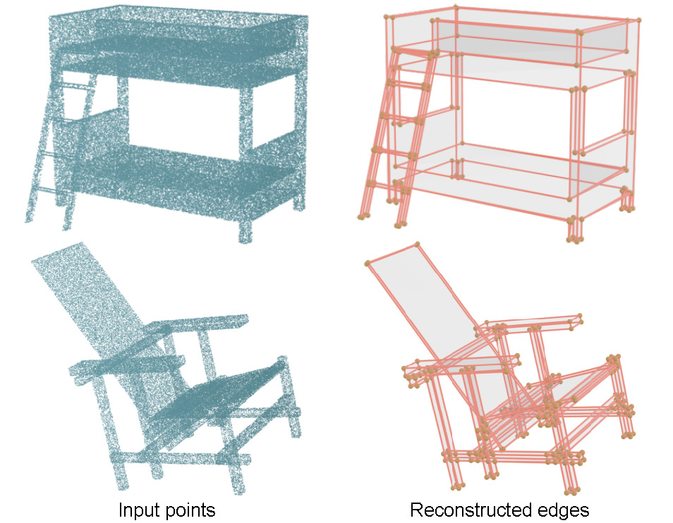

## Deep Point Cloud Edge Reconstruction Via Surface Patch Segmentation

**Authors**: Yuanqi Li, Hongshen Wang, Yansong Liu, Jingcheng Huang, Shun Liu, Chenyu Huang, Jianwei Guo, Jie Guo, Yanwen Guo


This repository provides source code for our paper published in TVCG 2025.


[Paper](https://ieeexplore.ieee.org/abstract/document/10909144)



> Parametric edge reconstruction for point cloud data is a fundamental problem in computer graphics. Existing methods first classify points as either edge points (including corners) or non-edge points, and then fit parametric edges to the edge points. However, few points are exactly sampled on edges in practical scenarios, leading to significant fitting errors in the reconstructed edges. Prominent deep learning-based methods also primarily emphasize edge points, overlooking the potential of non-edge areas. Given that sparse and non-uniform edge points cannot provide adequate information, we address this challenge by leveraging neighboring segmented patches to supply additional cues. We introduce a novel two-stage framework that reconstructs edges precisely and completely via surface patch segmentation. First, we propose **PCER-Net**, a Point Cloud Edge Reconstruction Network that segments surface patches, detects edge points, and predicts normals simultaneously. Second, a joint optimization module is designed to reconstruct a complete and precise 3D wireframe by fully utilizing the predicted results of the network. Concretely, the segmented patches enable accurate fitting of parametric edges, even when sparse points are not precisely distributed along the model's edges. Corners can also be naturally detected from the segmented patches. Benefiting from fitted edges and detected corners, a complete and precise 3D wireframe model with topology connections can be reconstructed by geometric optimization. Finally, we present a versatile patch-edge dataset, including CAD and everyday models (furniture), to generalize our method. Extensive experiments and comparisons against previous methods demonstrate our effectiveness and superiority. 

### Installation

To install conda environment:

```
conda env create -f environment.yml -n pcernet
source activate pcernet
```

------

### Data

#### 1. Dataset Downloads

- **ABC-edge**
  - Our ABC-edge dataset is derived from the [ABC](https://deep-geometry.github.io/abc-dataset/) and contains approximately 28,000 models.
  - Download Links:
    - [NJU Box](https://box.nju.edu.cn/d/d933d366fb824f678a11/)
    - [Baidu Netdisk](https://pan.baidu.com/s/1n9KtmgV0PPLSE1hCDU4nuQ?pwd=w2vz)
  
- **ModelNet-edge**
  - Our ModelNet-edge dataset contains 654 models selected from [ModelNet10](https://modelnet.cs.princeton.edu/).
  - Download Links:
    - [NJU Box](https://box.nju.edu.cn/d/803278340eae4d389202/)
    - [Baidu Netdisk](https://pan.baidu.com/s/1A2kVwFTK6HKGC45lim253w?pwd=evm5)

#### 2. Creating Your Own Dataset

Prepare each model with the following data:

- **points**: Coordinates  
- **normals**: Normals  
- **labels**: Patch instance labels (0, 1, 2, ...)  
- **label**: Soft edge labels  
- **W**: Edge weights  

Then, combine all models into a `.h5` file. 

#### 3. Loading Dataset Path

To use the dataset, modify the loading path in the `dataset` class located in `src/dataset_segments.py`. For example:

```
with h5py.File("/data/train_modelnet.h5", "r") as hf: # load train data

with h5py.File("/data/test_modelnet.h5", "r") as hf:  # load test data
```

Ensure the format within the `.h5` file matches the expected input.

------


### Experiments

#### Network

- To train the PCER-Net:

```
python train_pcernet.py configs/config_modelnet_pcernet.yml
```

- To test the trained model:

To use the pre-trained model, set the `pretrain_model_path` in the configuration to load the model. We also provide the checkpoint trained on the **ModelNet-edge** dataset. You can download it from the following links:

- [NJU Box](https://box.nju.edu.cn/f/61438f49d9df4570a3ae/)
- [Baidu Netdisk](https://pan.baidu.com/s/1M4MgR4KKRjTfBkdufci9NQ?pwd=j9g3)
```
python my_test.py configs/config_modelnet_pcernet.yml 
```

#### Reconstruction

Coming soon.

------


### Acknowledgements

We would like to thank and acknowledge referenced codes from [ParSeNet](https://github.com/Hippogriff/parsenet-codebase), [SED-Net](https://github.com/yuanqili78/SED-Net), [ABC](https://deep-geometry.github.io/abc-dataset/) and [ModelNet](https://modelnet.cs.princeton.edu/).

------


### Citation

```
@ARTICLE{10909144,
  author={Li, Yuanqi and Wang, Hongshen and Liu, Yansong and Huang, Jingcheng and Liu, Shun and Huang, Chenyu and Guo, Jianwei and Guo, Jie and Guo, Yanwen},
  journal={IEEE Transactions on Visualization and Computer Graphics}, 
  title={Deep Point Cloud Edge Reconstruction Via Surface Patch Segmentation}, 
  year={2025},
  volume={},
  number={},
  pages={1-15},
  keywords={Image edge detection;Solid modeling;Point cloud compression;Surface reconstruction;Fitting;Three-dimensional displays;Optimization;Surface fitting;Corner detection;Accuracy;Deep neural network;edge reconstruction;point cloud},
  doi={10.1109/TVCG.2025.3547411}}

```
